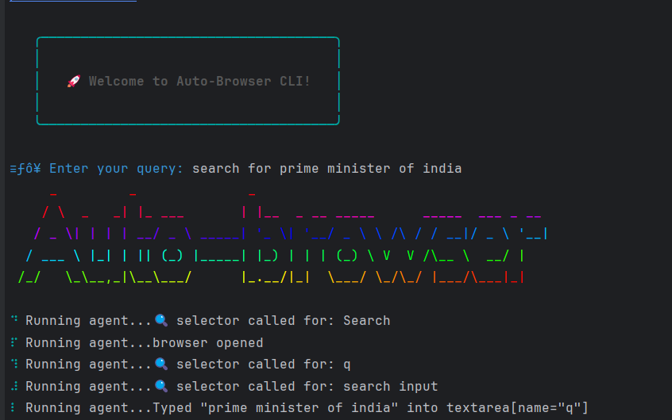

# 🤖 AI Browser Automation Agent (CLI)

An AI-powered browser automation agent that executes simple natural language commands through the command line.  
It combines **AI + browser automation** to perform everyday web tasks with simple instructions.

---

##  Features
-  Open links in the browser  
-  Perform Google searches  
-  Fill input boxes and interact with web forms  
-  Simple CLI interface for running commands  

---

##  Demo
  🎥 [Watch Demo Video](https://youtu.be/hqXsUnZXsSM)

  
    

---

## 🛠️ Tech Stack
- **[OpenAI SDK](https://www.npmjs.com/package/openai)** 
- **JavaScript**  
- **[Playwright](https://playwright.dev/)**
- **[Zod](https://zod.dev/)** – Input validation  

---

## ⚙️ Setup & Installation

1. **Clone the repository**
    ```bash
   git clone https://github.com/your-username/browser-ai-agent.git
   cd browser-ai-agent
 
2. **Install Dependencies**
    ```text
    npm install
3. **Configure OpenAi/gemini/llm key**
    ```env
   Create a .env file in the root directory and add your OpenAI API key:
   OPENAI_PUBLIC_KEY=your_openai_api_key_here
4. **Run Project**
   ```text
   npm run dev
5. **Enter Your Query**
    ```text
    Eg: Search for Prime Minister of India online.   
  
